# RAG System Query Processing Workflow

```mermaid
graph TD
    %% Frontend Layer
    A[User Types Query] --> B["sendMessage() Called"]
    B --> C[Disable Input & Show Loading]
    C --> D[POST /api/query]
    
    %% API Layer
    D --> E[FastAPI /api/query Endpoint]
    E --> F{Session ID Exists?}
    F -->|No| G[Create New Session]
    F -->|Yes| H[Use Existing Session]
    G --> I["Call rag_system.query()"]
    H --> I
    
    %% RAG Orchestration Layer
    I --> J[Get Conversation History]
    J --> K[Create System Prompt]
    K --> L["Call ai_generator.generate_response()"]
    
    %% AI Generation Layer
    L --> M[Build API Parameters]
    M --> N[Call Anthropic Claude API]
    N --> O{Claude Wants to Use Tools?}
    
    %% Tool Decision Branch
    O -->|No| P[Return Direct Response]
    O -->|Yes| Q[Extract Tool Calls]
    
    %% Tool Execution Flow
    Q --> R["tool_manager.execute_tool()"]
    R --> S["CourseSearchTool.execute()"]
    S --> T["vector_store.search()"]
    
    %% Vector Store Search
    T --> U[ChromaDB Semantic Search]
    U --> V[Find Relevant Chunks]
    V --> W[Format Results with Context]
    W --> X[Store Sources for UI]
    
    %% Return Tool Results
    X --> Y[Return Search Results]
    Y --> Z[Claude Generates Final Response]
    Z --> AA[Return AI Response]
    
    %% Response Assembly
    P --> BB[Get Sources from Tool Manager]
    AA --> BB
    BB --> CC[Update Conversation History]
    CC --> DD["Return (response, sources)"]
    
    %% API Response
    DD --> EE[Build JSON Response]
    EE --> FF[Return to Frontend]
    
    %% Frontend Display
    FF --> GG[Remove Loading Animation]
    GG --> HH[Parse Response JSON]
    HH --> II[Render AI Answer with Markdown]
    II --> JJ["Display Sources (Collapsible)"]
    JJ --> KK[Re-enable Input]
    KK --> LL[Ready for Next Query]
    
    %% Error Handling Path
    D -.->|Error| MM[Display Error Message]
    T -.->|No Results| NN["Return 'No content found'"]
    N -.->|API Error| MM
    
    %% Styling
    classDef frontend fill:#e1f5fe,stroke:#01579b,stroke-width:2px
    classDef api fill:#f3e5f5,stroke:#4a148c,stroke-width:2px
    classDef rag fill:#e8f5e8,stroke:#1b5e20,stroke-width:2px
    classDef ai fill:#fff3e0,stroke:#e65100,stroke-width:2px
    classDef tools fill:#fce4ec,stroke:#880e4f,stroke-width:2px
    classDef vector fill:#f1f8e9,stroke:#33691e,stroke-width:2px
    
    class A,B,C,D,GG,HH,II,JJ,KK,LL,MM frontend
    class E,F,G,H,EE,FF api
    class I,J,K,BB,CC,DD rag
    class L,M,N,O,P,AA ai
    class Q,R,S,Y,Z tools
    class T,U,V,W,X vector
```

## Key Components by Layer

### 🖥️ Frontend Layer (`script.js`)
- **User Interface**: Input handling, loading states
- **API Communication**: HTTP requests to backend
- **Response Display**: Markdown rendering, source citations

### 🔌 API Layer (`app.py`)
- **Request Handling**: FastAPI endpoint routing
- **Session Management**: Create/retrieve conversation sessions
- **Response Formatting**: JSON serialization

### 🧠 RAG Orchestration (`rag_system.py`)
- **Component Coordination**: Manages all system components
- **History Management**: Conversation context tracking
- **Response Assembly**: Combines AI output with sources

### 🤖 AI Generation (`ai_generator.py`)
- **Claude Integration**: Anthropic API communication  
- **Tool Orchestration**: Function calling coordination
- **Response Generation**: Natural language synthesis

### 🔧 Tool Layer (`search_tools.py`)
- **Search Interface**: Semantic search tool for Claude
- **Result Formatting**: Context-aware output formatting
- **Source Tracking**: UI citation management

### 📊 Vector Store (`vector_store.py`)
- **Semantic Search**: ChromaDB similarity matching
- **Document Retrieval**: Chunk-based content access
- **Metadata Filtering**: Course/lesson-specific searches

## Data Flow Summary

1. **Input**: User query → Frontend
2. **Transport**: HTTP POST → FastAPI
3. **Orchestration**: RAG system coordination
4. **Intelligence**: Claude AI with tool access
5. **Search**: Semantic vector search when needed
6. **Assembly**: Response + sources combination
7. **Display**: Formatted output to user

The system uses a **tool-based approach** where Claude autonomously decides when to search based on query content, making it more efficient than always searching.